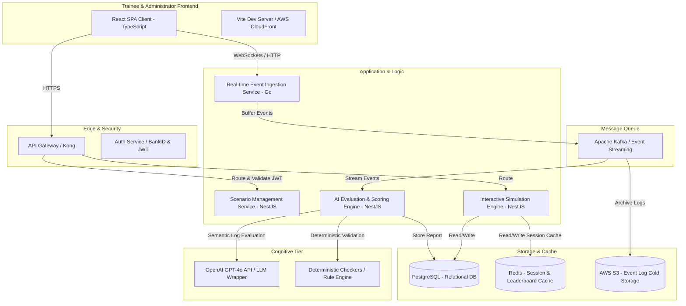

# AI Prompt — CRM Training Simulator Platform

## Project Name
(Working title)
- TrainFlow
- SimCRM
- Operator Academy
- FlowDesk
- CRM Coach

---

# Project Vision

Build a browser-based AI-powered CRM training simulator platform for telecom, customer service, retail, and sales organizations.

The platform should simulate realistic CRM workflows used by telecom operators, call centers, retail stores, and customer support teams in Sweden and Europe.

The goal is to allow new employees to safely train in a realistic environment before handling real customers.

The platform MUST NOT copy or clone existing CRM systems exactly for legal reasons. Instead, it should reproduce the workflow logic, stress, navigation patterns, and operational processes commonly found in telecom CRM systems.

The platform should feel inspired by systems like:
- Vendo
- Tasktool
- Telecom operator systems
- Retail telecom CRMs
- Customer service dashboards

But it must use:
- original UI
- original naming
- original architecture
- fake/generated data

---

# Core Problem

New employees in telecom/customer service environments often:
- become stressed
- click wrong options
- damage live customer accounts
- create incorrect orders
- forget documentation
- struggle to navigate complex systems

Traditional onboarding is weak:
- PDFs
- videos
- shadowing coworkers
- static guides

People learn better through:
- repetition
- simulation
- mistakes
- realistic pressure
- interactive scenarios

The platform should act like a:
- flight simulator for CRM systems
- Duolingo for telecom/customer service
- AI onboarding academy

---

# Main Features

# 1. CRM Simulation Environment

Build a fake but realistic CRM system.

The CRM should include:
- customer profiles
- subscriptions
- invoices
- orders
- support tickets
- notes
- call history
- contract periods
- address management
- number porting
- upselling
- cancellation flows
- retention workflows

The UI should feel professional and realistic.

The system should include:
- sidebar navigation
- customer search
- tabs
- forms
- dropdowns
- notifications
- order flows
- ticket flows

The UI should NOT directly copy existing CRM products.

---

# 2. Scenario Engine

The platform must generate training scenarios.

Examples:
- customer wants new subscription
- angry customer threatening cancellation
- invoice issue
- failed number port
- broadband installation issue
- upsell opportunity
- retention case
- family plan setup
- smartwatch pairing issue
- address mismatch
- fraud/security verification

Each scenario should include:
- customer profile
- account data
- hidden problems
- time pressure
- objectives

Difficulty levels:
- beginner
- intermediate
- advanced
- expert

Scenarios should be replayable and randomized.

---

# 3. AI Evaluation System

The system should evaluate user performance.

Track:
- click paths
- navigation efficiency
- errors
- missed steps
- time spent
- workflow accuracy

The AI should provide:
- score
- feedback
- suggestions
- corrections
- best practices

Example feedback:
- "You forgot to verify the customer's identity."
- "You selected the wrong subscription type."
- "You solved the issue correctly but used an inefficient workflow."

Evaluation categories:
- accuracy
- speed
- compliance
- customer handling
- CRM navigation
- documentation quality

---

# 4. AI Customer Simulation

Future feature but architecture should support it.

The AI should simulate customers via:
- chat
- voice
- emotional behavior

Customer personalities:
- angry
- confused
- elderly
- technical
- impatient
- friendly

AI should dynamically respond to:
- user behavior
- sales tactics
- empathy
- mistakes

The AI should evaluate:
- tone
- empathy
- policy compliance
- sales ability
- communication quality

---

# 5. Gamification

Include:
- XP
- levels
- achievements
- certifications
- leaderboard
- daily challenges
- streaks

Example:
- "Porting Master"
- "Retention Expert"
- "Fastest Resolution"

---

# 6. Analytics Dashboard

For managers/admins.

Track:
- employee progress
- onboarding speed
- weak areas
- common mistakes
- completion rates
- scenario success rates

Admin features:
- create scenarios
- assign training
- monitor teams
- export reports

---

# Technical Requirements

# Frontend
Use:
- Next.js
- React
- TypeScript
- TailwindCSS

Requirements:
- responsive design
- modern UI
- fast interactions
- modular architecture

---

# Backend

Recommended:
- Node.js OR Python backend
- REST API OR GraphQL

Suggested:
- NestJS
- Express
- FastAPI

---

# Database

Use:
- PostgreSQL

Possibly:
- Redis for sessions/realtime

---

# AI Integration

Use LLM APIs for:
- evaluation
- customer simulation
- feedback generation
- scenario generation

The AI should NOT fully control scoring.

Use:
- rule-based systems
- workflow validation
- deterministic checks

combined with AI analysis.

---

# Tracking System

Track every:
- click
- action
- workflow
- tab change
- order sequence
- field edit

Store event logs for replay and analytics.

---

# Authentication

Roles:
- trainee
- coach
- admin
- company owner

Support:
- multi-tenant organizations

---

# Architecture Goals

The project should be:
- scalable
- modular
- SaaS-ready
- enterprise-ready
- secure
- easy to expand into multiple industries

---

# Industries To Support Later

Initial focus:
- telecom

Future expansion:
- banking
- insurance
- retail
- healthcare support
- SaaS customer support
- IT helpdesk

---

# MVP Scope

Build ONLY:
- one CRM simulator
- telecom workflow
- customer search
- order flow
- 10–20 scenarios
- AI scoring
- basic analytics

Avoid overengineering.

Focus on:
- realism
- onboarding value
- speed
- usability

---

# Design Style

The interface should feel:
- modern
- clean
- enterprise-grade
- realistic
- professional

Avoid:
- cartoonish design
- childish gamification
- overly flashy UI

Use:
- subtle animations
- realistic tables/forms
- modern dashboard aesthetics

---

# Important Legal Constraints

DO NOT:
- clone existing CRM UIs exactly
- use copyrighted assets
- use operator branding
- use real customer data
- use proprietary workflows directly

DO:
- abstract workflows
- create original UI/UX
- use generated fake data
- simulate generic telecom operations

---

# Suggested Future Features

- voice call simulator
- AI call analysis
- multiplayer team training
- onboarding certification
- recruitment testing
- browser extension assistant
- live coaching mode
- AI-generated scenarios
- heatmaps of user confusion
- top performer analytics

---

# Comprehensive Architecture & System Design Deliverables

This section provides the complete technical architecture and system specifications requested for the **Operator Academy / SimCRM** training simulator platform.

---

## 1. Full Product Architecture

The system utilizes a modern, resilient **3-Tier Cloud-Native Architecture** coupled with an asynchronous event broker. Below is a high-level visual representation of the system components:



---

## 2. Database Schema

The core relational database model uses **PostgreSQL** for strict relational integrity, transactions, and auditability. Below is the Entity-Relationship schema:

```mermaid
erDiagram
    ORGANIZATIONS ||--o{ USERS : has
    ORGANIZATIONS ||--o{ SCENARIOS : customizes
    USERS ||--o{ TRAINING_SESSIONS : completes
    SCENARIOS ||--o{ TRAINING_SESSIONS : templates
    TRAINING_SESSIONS ||--o{ EVENT_LOGS : records
    TRAINING_SESSIONS ||--o{ EVALUATIONS : results_in
    USERS ||--o{ LEADERBOARD : ranks

    ORGANIZATIONS {
        uuid id PK
        varchar name
        varchar sweden_org_number
        varchar subscription_tier
        timestamp created_at
    }

    USERS {
        uuid id PK
        uuid organization_id FK
        varchar email
        varchar password_hash
        varchar full_name
        varchar role "trainee | coach | admin | owner"
        int xp_points
        int current_level
        timestamp created_at
    }

    SCENARIOS {
        uuid id PK
        uuid organization_id FK "nullable for global scenarios"
        varchar title
        varchar difficulty "beginner | intermediate | advanced | expert"
        jsonb initial_state "customer account details, active plans"
        jsonb validation_rules "checklist requirements, expected changes"
        text customer_personality "angry | confused | elderly"
        boolean active
    }

    TRAINING_SESSIONS {
        uuid id PK
        uuid user_id FK
        uuid scenario_id FK
        varchar status "started | completed | aborted"
        timestamp started_at
        timestamp completed_at
        int duration_seconds
    }

    EVENT_LOGS {
        uuid id PK
        uuid session_id FK
        varchar event_type "tab_changed | verified_id | plan_modified | call_logged"
        varchar target_element "e.g., invoice_tab, skv_verify_btn"
        jsonb details "contains payload e.g. inputted note text or plan ID"
        timestamp created_at
    }

    EVALUATIONS {
        uuid id PK
        uuid session_id FK UNIQUE
        int total_score "0-100"
        jsonb metric_scores "accuracy, compliance, speed, communication, documentation"
        text coach_feedback
        varchar grade "A+ | B | F"
        jsonb missed_objectives
        timestamp created_at
    }

    LEADERBOARD {
        uuid id PK
        uuid user_id FK UNIQUE
        int current_xp
        int rank_position
        timestamp last_updated
    }
```

---

## 3. Frontend Structure

The frontend is a single-page application built on **React 18+**, **TypeScript**, and **TailwindCSS** for rapid, responsive UI construction. It uses state slices powered by **Zustand** for lightweight, performance-tuned global state management (ideal for handling reactive simulator tracking).

```
frontend/
├── public/                 # Static assets, branding logos, generic SVGs
├── src/
│   ├── assets/             # Component-specific styles and images
│   ├── components/         # Reusable presentation and UI components
│   │   ├── ui/             # Core UI atoms (Button, Card, Input, Tab)
│   │   ├── bankid/         # Authentically styled BankID interactive portals
│   │   ├── crm/            # Custom CRM panels (Overview, Billing, Porting)
│   │   └── chat/           # Live client simulation chat interface
│   ├── hooks/              # Custom React hooks (useTimer, useActiveSession)
│   ├── layouts/            # Dashboard page structures and grids
│   ├── scenarios/          # Hardcoded mock scenario datasets
│   ├── services/           # HTTP/WebSocket API callers
│   ├── store/              # Zustand global state (auth, session, logs)
│   ├── utils/              # Evaluators, validators, log parsers
│   ├── App.jsx             # Simulator Shell page orchestrator
│   └── main.jsx            # Entrypoint
```

---

## 4. Backend Structure

The backend relies on the enterprise-ready **NestJS** framework using modular architectural design, dividing business domains into isolated, self-contained sub-units.

```
backend/
├── src/
│   ├── auth/               # Passport.js JWT validation, BankID OIDC logic
│   ├── organization/       # Organization and user workspace operations
│   ├── scenario/           # Scenario repository and randomization engines
│   ├── session/            # Training sessions tracker
│   ├── tracker/            # Real-time event logging & Kafka producers
│   ├── evaluation/         # Rule engine & GPT-4o asynchronous evaluators
│   ├── prisma/             # Prisma ORM client models
│   ├── app.module.ts       # Module aggregator
│   └── main.ts             # Server configuration
```

---

## 5. API Design

### Authentication Endpoints
- `POST /api/v1/auth/bankid/initiate` - Starts Swedish BankID auth session; returns QR token/auth reference.
- `POST /api/v1/auth/bankid/collect` - Polls BankID verification state; returns JWT token on success.
- `POST /api/v1/auth/login` - Username/Password login for coaches/admins.

### Scenario Management
- `GET /api/v1/scenarios` - Fetches active training modules filtered by difficulty.
- `GET /api/v1/scenarios/:id` - Fetches specific scenario layout baseline dataset.

### Active Training Simulator Sessions
- `POST /api/v1/sessions/start` - Starts a training session. Body: `{ scenario_id: "uuid" }`. Returns `session_id` and initial data.
- `POST /api/v1/sessions/:id/events` - Ingests batch interaction event logs. Body: `[{ event_type: "...", target: "...", details: {}, timestamp: "..." }]`.
- `POST /api/v1/sessions/:id/submit` - Locks active simulation and schedules scoring. Returns evaluation report ID.

### Scoring & Analytics
- `GET /api/v1/evaluations/:id` - Retrieves granular scoring card, levels/XP increases, and AI-coach remarks.
- `GET /api/v1/analytics/cohort` - Cohort analysis of common errors (Admins/Coaches only).

---

## 6. AI Evaluation Architecture

Evaluation utilizes a hybrid pipeline combining high-performance **Deterministic Rule-Based Checkers** with a semantic **LLM Evaluation Scorer**.

```
                   +----------------------------------+
                   |     Trainee Submits Session      |
                   +----------------------------------+
                                    |
                                    v
                   +----------------------------------+
                   |  Collect Session Event logs and  |
                   |      completed subscriptions     |
                   +----------------------------------+
                                    |
            +-----------------------+-----------------------+
            |                                               |
            v                                               v
+-----------------------------------+     +-----------------------------------+
|      Deterministic Rule Engine    |     |         AI Semantic Scorer        |
|  * Checked identity? (Yes/No)     |     |   * Evaluates custom support logs |
|  * Visited billing history? (Y/N) |     |     written by trainee.           |
|  * Saved customer from churn?     |     |   * Rates professionalism, tone, |
|  * Applied valid discount plan?   |     |     empathy, and detail depth.    |
+-----------------------------------+     +-----------------------------------+
            |                                               |
            +-----------------------+-----------------------+
                                    |
                                    v
                   +----------------------------------+
                   |     Consolidated Scorecard       |
                   |  Calculates Grade (A+ to F)      |
                   |  XP Allocation & Badge awards   |
                   +----------------------------------+
```

1. **Deterministic Layer (Compliance & Workflow)**: Checks logs for key interactions. Did they click "Verify BankID" *before* modifying billing? Did they apply the specific retention discount (e.g. `RETENTION_BROADBAND_20`)?
2. **AI Semantic Layer (Communication & Documentation)**: Sends the support log written by the trainee, the dialogue log, and the customer profile to **GPT-4o**. GPT evaluates the compliance of documentation and ranks the tone, returning structured grading metrics.

---

## 7. Event Tracking Architecture

Every user action in the simulator is captured as an `EventLog` payload.
```json
{
  "session_id": "8b51d5c2-f153-4819-bf93-3d02a0a2df3d",
  "event_type": "crm_action",
  "target_element": "subscription_modify_button",
  "details": {
    "active_tab": "abonnemang",
    "previous_plan": "Bredband 500",
    "new_plan": "Bredband 250 + Retention 20%",
    "customer_id": "19840212-3456",
    "user_input": null
  },
  "timestamp": "2026-05-20T00:42:00Z"
}
```

---

## 8. Authentication System

1. **Swedish BankID OIDC Integration**:
   - Simulator mimics OIDC standard. A dynamic QR code is rendered on screen.
   - Using the BankID API `/rp/v6.0/auth` (in production) or simulated loops, the trainee scans with their phone or starts a "BankID på samma enhet" (BankID on same device) sequence.
2. **Role-Based Access Control (RBAC)**:
   - **Trainee**: Access only to assigned scenarios, simulator shell, and personal dashboards.
   - **Coach**: Access to cohort analytics, grading reports, log reviews, and manual feedback overlays.
   - **Admin/Owner**: Tenant user management, scenario creation, billing details, and enterprise export.

---

## 9. MVP Roadmap

```
+----------------------------------------------------------------------------+
|  Phase 1: Core Simulator Core (Weeks 1-4)                                  |
|  * Build high-fidelity client CRM Simulator Shell                          |
|  * Deliver BankID mock login and customer chat simulator                   |
|  * Configure 5 Swedish Operator Scenarios                                  |
+----------------------------------------------------------------------------+
                                     |
                                     v
+----------------------------------------------------------------------------+
|  Phase 2: Hybrid Evaluation Engine (Weeks 5-8)                             |
|  * Deploy event tracker and deterministic workflow checkers                 |
|  * Program OpenAI API GPT-4o semantic logs evaluation module               |
|  * Build scorecard visual interface and gamification features (XP/Badges)   |
+----------------------------------------------------------------------------+
                                     |
                                     v
+----------------------------------------------------------------------------+
|  Phase 3: Multi-tenant SaaS & Coaching Portal (Weeks 9-12)                |
|  * Establish tenant org database structure (PostgreSQL separation)         |
|  * Build Coaching Dashboard with aggregated error analytics and feedback  |
|  * Launch security validation and enterprise role access settings          |
+----------------------------------------------------------------------------+
```

---

## 10. UI Wireframes

### Wireframe A: Trainee Authentication (Swedish BankID)
```
+-----------------------------------------------------------------------+
|                                                                       |
|                     O P E R A T O R   A C A D E M Y                   |
|                                                                       |
|     +-----------------------------------------------------------+     |
|     |                       Logga in                            |     |
|     |  Vänligen identifiera dig med BankID för att starta.      |     |
|     |                                                           |     |
|     |                 [   QR-KOD BILD   ]                       |     |
|     |                                                           |     |
|     |            [ Skanna QR-kod / BankID på denna enhet ]      |     |
|     |                                                           |     |
|     |            Personnummer (ÅÅÅÅMMDD-XXXX):                  |     |
|     |            [ 19900918-7890                        ]       |     |
|     |                                                           |     |
|     |                     [ Starta BankID ]                     |     |
|     +-----------------------------------------------------------+     |
|                                                                       |
+-----------------------------------------------------------------------+
```

### Wireframe B: Main Simulator Shell
```
+--------------------------------------------------------------------------------------------------------+
| [Academy Nav Bar: Level 4 | XP: 3400/4000 | Active: Scenario 1 - Expired Discount]      Time: 02:45    |
+----------------------------------------+------------------------------------------+--------------------+
| SCENARIO & OBJECTIVES                  | SIMCRM WORKSPACE                         | CUSTOMER CHAT      |
+----------------------------------------+------------------------------------------+--------------------+
| Scenario: Expired Broadband Discount   | Search: [ 19840212-3456          ] [Sök] | Sent: Impatient 😟 |
| Customer Anna Berg calls. Her bill     | Name: Anna Berg  | ID: Verified (SKV) [V] |                    |
| went from 299 to 599 SEK.              | +--------------------------------------+ | "Why did my plan   |
|                                        | | Översikt | Abonnemang | Fakturor | Port | | double? I will     |
| Objectives Checklist:                  | +--------------------------------------+ | cancel now!"       |
| [X] Verify Customer Identity           | | Active Plans:                         |                    |
| [ ] Open Billing history & explain     | | * Bredband 500 - 599 SEK/m (Exp)     | Selection Option:  |
| [ ] Apply Retention Discount (20%)     | |                                        | ( ) Explain billing|
| [ ] Log case details in history        | | Offers:                                | (X) Empathize &    |
|                                        | | [ Apply 20% Retention ]                |     offer discount |
| [ Submit Case for Grading ]            | | [ Move to Family Plan ]                | ( ) Accuse user    |
+----------------------------------------+------------------------------------------+--------------------+
```

### Wireframe C: AI Scoring Overlay
```
+-----------------------------------------------------------------------+
|                       UTVÄRDERINGSRESULTAT                            |
|                  SLUTBETYG: A (Utmärkt insats)                        |
+-----------------------------------------------------------------------+
|                                                                       |
|  * RÄTTNINGSMETRIK:                                                   |
|    - Noggrannhet (Accuracy):      [====================] 100%         |
|    - Regelefterlevnad (Compliance):[====================] 100%         |
|    - Effektivitet (Efficiency):    [===============-----]  75%         |
|    - Kundbemötande (Customer Sat): [==================--]  90%         |
|    - Dokumentationskvalitet:      [====================] 100%         |
|                                                                       |
|  * FEEDBACK FRÅN COACH AI:                                            |
|    "Du hanterade Anna på ett fantastiskt sätt! Du lugnade henne och    |
|     sänkte hennes bredbandskostnad genom att erbjuda rätt rabatt.     |
|     Du verifierade även hennes adress. Bra jobbat!"                    |
|                                                                       |
|  * BELÖNINGAR:                                                        |
|    +450 XP  |  Unlock: "Retention Master" Badge                       |
|                                                                       |
|                         [ NÄSTA SCENARIO ]                            |
+-----------------------------------------------------------------------+
```

---

## 11. Suggested Folder Structure

For deployment simplicity and development coordination, a **Monorepo setup using Turborepo** is suggested:

```
/workspace
├── apps/
│   ├── web/                # React / Vite frontend SPA application
│   └── api/                # NestJS backend API application
├── packages/
│   ├── db/                 # Shared database client (Prisma client)
│   ├── eslint-config/      # Shareable ESLint styles
│   └── types/              # Common TypeScript shared interfaces
├── turbo.json              # Turborepo task pipeline config
├── package.json
└── README.md
```

---

## 12. Tech Stack Recommendations

| Layer | Component | Choice | Rationale |
| :--- | :--- | :--- | :--- |
| **Frontend** | Base Architecture | **React 18 + TS + Vite** | Lightweight SPA, fast development loop, robust ecosystem. |
| **Frontend** | Styling | **Vanilla CSS & UI Atoms** | Maximum pixel-perfect styling fidelity for realistic CRMs. |
| **Frontend** | State Management | **Zustand** | Instantaneous, selector-based react states, simple APIs. |
| **Backend** | API Engine | **NestJS** | Standardized, highly structured architecture, ideal for scale. |
| **Database** | Primary DB | **PostgreSQL** | Rigid consistency, transactional security, JSONB index support. |
| **Database** | Cache / Session | **Redis** | In-memory key-value store, handles live scoring leaderboards. |
| **AI Layer** | LLM Engine | **OpenAI GPT-4o API** | Premium accuracy in Swedish processing and semantic evaluation. |
| **DevOps** | Containerization | **Docker** | Ensures identical runtime conditions in dev and prod. |

---

## 13. Scaling Strategy

As student cohorts expand, the simulator handles thousands of concurrent training loops via:
1. **Asynchronous LLM Scoring Pipelines**: Rather than running the LLM during the HTTP request, submissions are added to a message queue. Workers compute and publish scores, returning updates using server-sent events (SSE).
2. **Static Distribution**: Client application files are built as plain JS/HTML and cached worldwide via CloudFront, eliminating backend loading overhead.
3. **Database Read Replicas**: Directing intensive coach reports and analytics aggregations to read-only DB replicas, keeping the write-heavy PostgreSQL instances dedicated to active sessions.

---

## 14. Multi-Tenant SaaS Strategy

To support multiple telecom providers securely:
1. **Logical Row-Level Separation**: All primary database models contain an `organization_id` index constraint. Query filters apply organization IDs dynamically via NestJS tenant interceptors.
2. **Custom CSS / White-Labeling**: Organizations upload custom logo assets and color configurations to AWS S3. These assets are pulled during startup to dynamically theme the CRM workspace (e.g. green for Telenor layout, blue/pink for Telia layout).
3. **Dedicated Schema Option**: For Enterprise-level security compliance, organization routers configure isolated database connection strings to point to dedicated PostgreSQL schemas.

---

## 15. Deployment Architecture

Deployments are hosted within **Amazon Web Services (AWS)** using Kubernetes for high availability and dynamic load scaling:

```
[Traffics (Trainees)]
       |
       v
  [AWS Route53]
       |
  [AWS CloudFront CDN] ----(Static Assets)----> [AWS S3 Bucket]
       |
  (API Requests)
       v
  [Application Load Balancer (ALB)]
       |
  [AWS Elastic Kubernetes Service (EKS)]
    ├── Pods: API Web Servers (NestJS)
    └── Pods: Event Workers (NestJS)
       |
       v
  [Managed Data Layers]
    ├── Primary Write DB: [AWS RDS PostgreSQL (Multi-AZ)]
    ├── Read Replicas: [AWS RDS Read Replicas]
    └── Cache Layer: [AWS ElastiCache Redis Cluster]
```

---

*This system design document serves as the implementation specification for SimCRM platforms.*


# Final Goal

Create the best AI-powered CRM onboarding and operational training simulator platform for telecom and customer service industries.

The platform should reduce:
- onboarding time
- costly mistakes
- employee stress
- manager dependency

while improving:
- confidence
- workflow accuracy
- customer handling
- operational efficiency
- employee performance